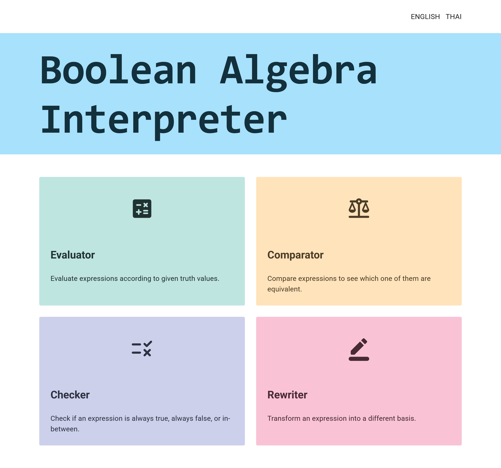
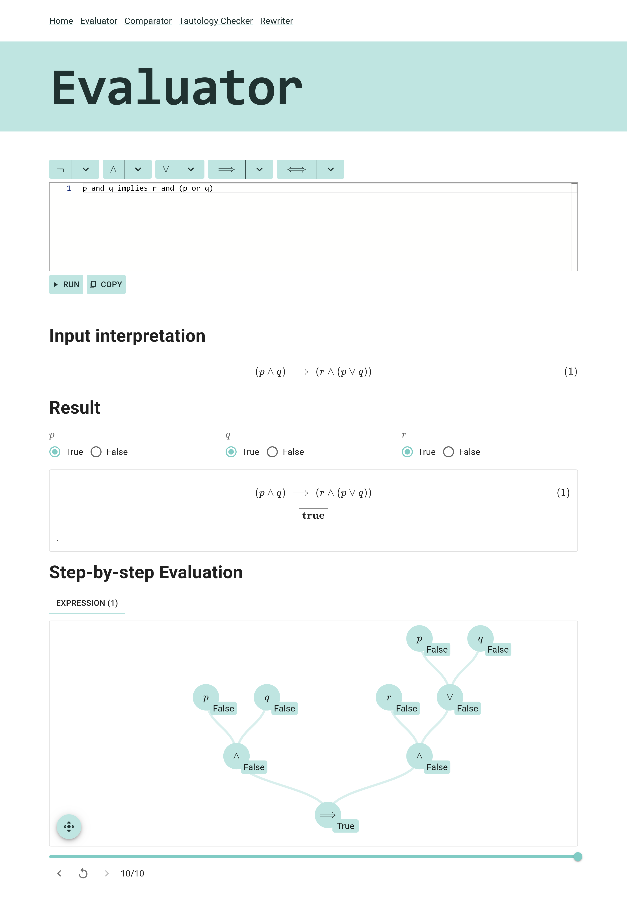
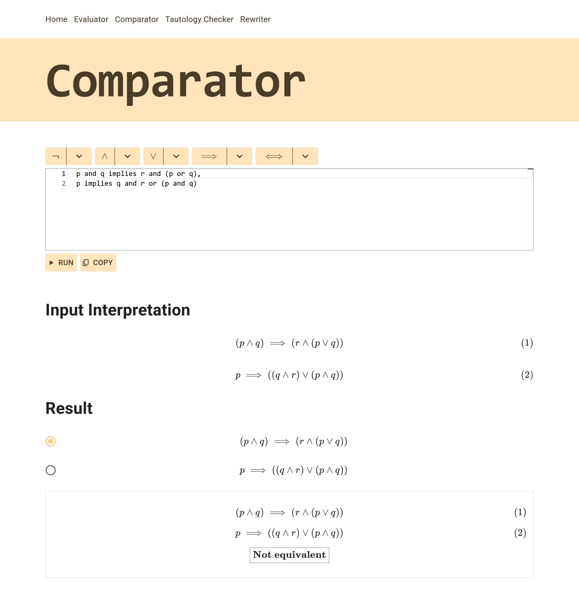
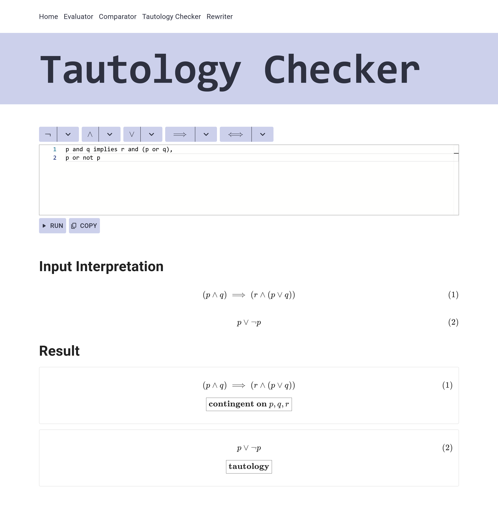
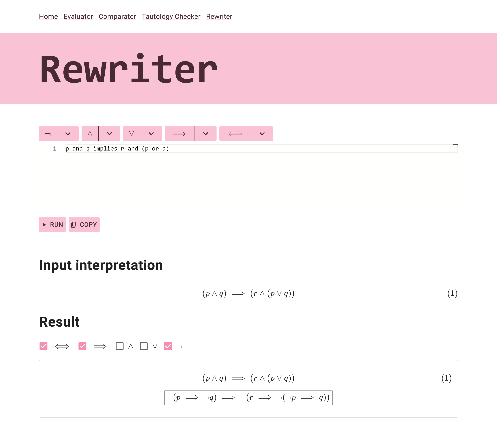

    

> Custom Boolean algebra intepreter powered by [OhmJS](https://ohmjs.org/), [KaTeX](https://katex.org/), and [visx](https://visx.airbnb.tech/)!

# ~Project Onyx | Visualize, Learn and Explorer Boolean Algebra

Powerful and interactive Boolean algebra visualizer that lets you examine the syntax tree, the truth table, equivalence, rewrite operators, and check for tautology (and contradition). Powered by [OhmJS](https://ohmjs.org/), [KaTeX](https://katex.org/), and [visx](https://visx.airbnb.tech/)!

## ~Evaluate Expressions

## ~Compare Truth Value Between Expressions

## ~Check for Tautology and Contradiction

## ~Rewrite Expressions using Given Operators

